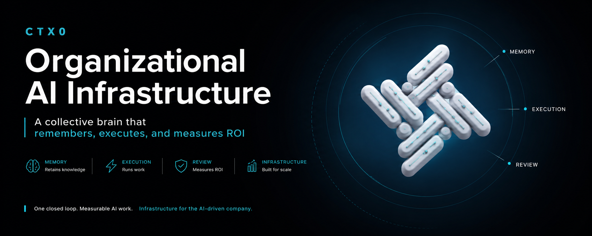

<p align="center">
  
</p>

# NEST — Self-Hosted AI Hub for Enterprise Teams

NEST is a self-hosted AI workforce hub that consolidates fragmented tool stacks into a single, governed plane: organizational memory, multi-agent orchestration, 700+ models via BYOK, and full audit trails — all running on infrastructure you own. Built by Context Zero (CTX0) under a fair-code license, NEST gives enterprises the speed of modern AI tooling without surrendering data, cost control, or operational sovereignty.

## Watch

| Product (60s) | Problem &amp; solution |
|:---:|:---:|
| [](https://youtu.be/KXJgjWesM1s) | [](https://youtu.be/5KeN9lwUZwE) |

## Key Capabilities

- **Self-Hosted by Default**: Deploy on cloud, on-prem, or air-gapped — your data never leaves your perimeter
- **BYOK Across 700+ Models**: Connect OpenRouter, Fal AI, and direct provider keys — no platform fees, no lock-in
- **Organizational Memory**: Persistent, project-scoped memory that learns from every employee — owned by your org
- **Multi-Agent Orchestration**: A swarm of specialist agents builds real outputs, with mandatory review and audit
- **Governance Built-In**: RBAC per project, granular approval flows, full audit trail of every prompt and action
- **Replaces 15+ Tools**: One hub for chat, code agents, computer-use automation, and document workflows

## Modules

NEST is organized as a set of composable modules sharing one audit and governance plane:

| Module | Function |
|---|---|
| **MISSION CONTROL** | Routing, projects, roles, approvals |
| **NEXUS** | Model layer — 700+ models via BYOK (OpenRouter, Fal AI, direct providers) |
| **FORGE** | Development layer — Cursor, Claude Code, and Codex on a shared audit trail |
| **OPERATOR** | Desktop automation (computer-use) under governance |
| **HIVE** | Persistent organizational memory, owned by the client |

## Quick Start

Deploy the self-hosted hub with [Docker](https://docs.docker.com/get-docker/). Clone the repo and run the setup script — it generates secrets, pulls the published images, starts the stack, and waits for health:

```
git clone https://github.com/contextzero/nest_hub.git
cd nest_hub
./setup.sh
```

Then open the PWA at `http://localhost` (or the `WEB_PORT` you set in `.env`) and install it on your phone, tablet, or desktop.

Day-2 operations:

```
docker compose up -d                          # start
docker compose down                           # stop
docker compose logs -f                        # stream logs
docker compose pull && docker compose up -d   # update to the latest images
```

### CLI for developer machines

Connect each workstation to your hub with the published CLI (package `@contextzero/nest`, binary `annie`):

```
npm install -g @contextzero/nest
annie auth login          # base URL of your hub + CLI token
annie claude              # or: annie cursor / annie codex / annie gemini ...
```

## Resources

- 📚 [Quick Start](QUICKSTART.md)
- 🛠 [Installation reference](docs/INSTALL.md)
- 🌐 [Production deploy (HTTPS)](docs/DEVOPS.md)
- 🤖 [CLI &amp; LLM / BYOK config](docs/CLI-BUSINESS.md)
- 🎬 [Product overview (60s)](https://youtu.be/KXJgjWesM1s)
- 🎥 [Problem &amp; solution](https://youtu.be/5KeN9lwUZwE)
- 👥 [Community](https://github.com/contextzero/nest_hub/discussions)

## Support

For installation questions and community support, open a [discussion](https://github.com/contextzero/nest_hub/discussions) or file an issue.

For enterprise support, SSO, advanced RBAC, and air-gapped deployments, contact [enterprise@ctx0.io](mailto:enterprise@ctx0.io).

## License

NEST is [fair-code](https://faircode.io) distributed under the [Sustainable Use License](https://github.com/contextzero/nest_hub/blob/main/LICENSE.md) and [NEST Enterprise License](https://github.com/contextzero/nest_hub/blob/main/LICENSE_EE.md).

- **Source Available**: Always visible source code
- **Self-Hostable**: Deploy anywhere — cloud, on-prem, or air-gapped
- **Extensible**: Add your own model providers, MCP servers, and agent specialists

[Enterprise Licenses](mailto:license@ctx0.io) available for advanced features and support.

> **Legal entity note.** **Context Zero** ("CTX0") is the brand and project, launched February 2026. The legal entity operating it is **Carlos Matias Baglieri LTD**, a UK private limited company (Company number 14267762, registered at 20-22 Wenlock Road, London, England, N1 7GU). All licensing, contracts, and IP rights are held by this entity. Governing law: England and Wales.

## Contributing

Found a bug 🐛 or have a feature idea ✨? Check our [Contributing Guide](https://github.com/contextzero/nest_hub/blob/main/CONTRIBUTING.md) for setup and best practices.

## Join the Team

Want to shape the future of enterprise AI infrastructure? Check out our [open roles](https://ctx0.io/careers) and join us.

## What does NEST mean?

**Short answer:** It is the hub where your organization's AI work lives — model access, agents, memory, and audit, all in one place.

**Long answer:** NEST is the gateway product of the Context Zero (CTX0) ecosystem. We started with a simple observation: companies have perfect visibility into their cloud spend and zero visibility into their AI spend. The same knowledge worker touches 14 AI tools and 6 subscriptions a week, with no shared memory, no audit, and no answer to the question "is this actually working?". NEST is the missing infrastructure layer that gives that answer back to the organization — without taking away the speed of the tools developers already love. It's free to self-host, fair-code by design, and built to scale with you toward the Team and Enterprise tiers of the CTX0 platform.

— **Carolina Fogliato**, Founder & CEO, Context Zero

## Built by

Shipping in public since February 2026.

- **Carolina Fogliato** — Founder & CEO
- **Matías Baglieri** — Fractional CAIO/CTO

Questions, feedback, or enterprise inquiries: caro@ctx0.io

---

## Important notice — self-hosted deployments, responsibility, and access

The following is a **general information notice** for customers and operators. It is **not** tailored legal advice; your counsel should review it against your contracts, jurisdiction, and regulatory obligations.

**Use and compliance.** Your organization — **not** Carlos Matias Baglieri LTD (operating the "Context Zero" / "CTX0" project), including its affiliates, contractors, or personnel (collectively "**Context Zero**") — is **solely responsible** for how you deploy, configure, secure, and use NEST, including all outputs of AI agents, integrations, data processing, employment practices, export controls, privacy, sectoral regulations, and internal policies. Context Zero does not supervise your runtime environment and does not assume liability for decisions your employees, agents, or systems make on your infrastructure.

**Self-hosted connectivity.** When you operate NEST as **self-hosted** software on infrastructure you control, **Context Zero does not operate that server**, does not receive an automatic administrative connection to it, and **cannot access** your installation merely because you downloaded or licensed materials from us. Your hub is joined by your users and tooling (for example the **`annie`** CLI from **`npm install -g @contextzero/nest`**) **outbound** to the endpoints **you** configure (your DNS, your TLS certificates, your tokens). Unless you separately contract for managed services that explicitly provide remote administration and scope of access, **no member of the Context Zero team is granted inbound access** to your servers as part of the self-hosted product model.

**No agency.** Nothing in this README creates a partnership, joint venture, or agency relationship. Context Zero is a software provider; **your company remains exclusively responsible** for lawful use, workforce governance, and the security of your deployment.

---

<div align="center">

*Public distribution: [contextzero/nest_hub](https://github.com/contextzero/nest_hub) · CLI: [@contextzero/nest](https://www.npmjs.com/package/@contextzero/nest)*

**© 2026 Carlos Matias Baglieri LTD · Operating the Context Zero / CTX0 project**

</div>
