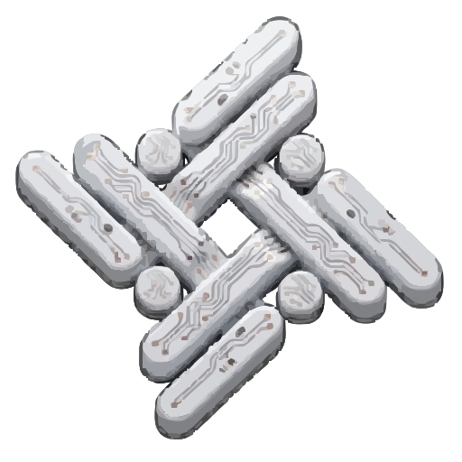
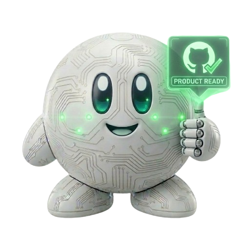

# NEST — Complete Workforce Automation Platform

<p align="center">
  
  
</p>

**By Context Zero.** NEST is a complete **workforce automation platform** — not just for coding. Your employees can manage machines, resolve tasks, send emails, do research, and more. Self-hosted for individuals, enterprise cloud for teams.

---

## The Two Versions

| Aspect | Community (Self-Hosted) | Enterprise |
|--------|------------------------|------------|
| **Deployment** | Your Docker server | Our cloud |
| **Price** | Free | Subscription |
| **Users** | Individual / Small team | Organization |
| **Agents** | Basic coding agents | Specialized + Darwin agents |
| **Memory** | Local only | Colony-wide memory |
| **Automation** | OpenClaw / ZeroClaw | Advanced workflows |
| **Support** | GitHub | Dedicated |

---

## What NEST Does (Everything)

```
┌─────────────────────────────────────────────────────────────────────────┐
│                         NEST PLATFORM                                    │
├─────────────────────────────────────────────────────────────────────────┤
│                                                                          │
│  ┌─────────────────┐  ┌─────────────────┐  ┌─────────────────────────┐  │
│  │   🤖 CODING     │  │  🖥️ DESKTOP    │  │   📧 COMMUNICATION     │  │
│  │   Claude        │  │   ZeroClaw      │  │   Email automation     │  │
│  │   Codex         │  │   OpenClaw      │  │   Slack/Teams          │  │
│  │   Cursor        │  │   Browser       │  │   Research             │  │
│  │   Gemini        │  │   File mgmt     │  │   Reports              │  │
│  └─────────────────┘  └─────────────────┘  └─────────────────────────┘  │
│                                                                          │
│  ┌─────────────────┐  ┌─────────────────┐  ┌─────────────────────────┐  │
│  │   🔍 RESEARCH   │  │  ⚡ AUTOMATION  │  │   🧠 INTELLIGENCE      │  │
│  │   Web scraping  │  │   ZeroClaw      │  │   Colony memory        │  │
│  │   Data analysis │  │   Scheduled     │  │   Darwin agents        │  │
│  │   Summarization │  │   triggers      │  │   Learning systems     │  │
│  └─────────────────┘  └─────────────────┘  └─────────────────────────┘  │
│                                                                          │
└─────────────────────────────────────────────────────────────────────────┘
```

---

## Key Concepts

### ZeroClaw & OpenClaw

**ZeroClaw** = Headless automation with self-correction
- Runs tasks autonomously
- Observes outcomes and adapts
- Full audit trail

**OpenClaw** = Project orchestration
- Task graphs with dependencies
- Multi-step workflows
- Browser and desktop control

### Colony Memory (Enterprise)

Every task teaches the system. The colony learns:
- Which agents work best for which tasks
- Employee preferences and patterns
- Project context across teams
- Optimal workflows by experience

### Darwin Agents (Enterprise)

Specialized agents that **evolve**:
1. User describes a need → System creates agent
2. Agent performs task → Performance tracked
3. Best agents survive → Replicated to team
4. Continuous improvement → Better results over time

---

## Quick Links

| What you need | Where to go |
|--------------|-------------|
| 5-minute start | [QUICKSTART.md](../QUICKSTART.md) |
| Install server | [INSTALL.md](INSTALL.md) |
| Enterprise features | [enterprise/README.md](enterprise/README.md) |
| Business overview for founders | [business/README.md](business/README.md) |
| Implementation methodology | [methodology/README.md](methodology/README.md) |
| CLI reference | [CLI-BUSINESS.md](CLI-BUSINESS.md) |
| What's next | [ROADMAP.md](../ROADMAP.md) |

---

## Architecture

```
YOU (Phone/Tablet)          SERVER                     EMPLOYEE MACHINE
───────────────          ────────────                ─────────────────
  📱 Dashboard    ←───  NEST Server      ←───      annie CLI
  ✅ Approvals          (Rust)                         (Agents)
  💬 Chat          ←──  Socket.IO / SSE               ZeroClaw
  📊 Stats        ←──  PostgreSQL                     OpenClaw
                        (Audit)
                        
                                                    YOUR INFRASTRUCTURE
                                                    (or Enterprise cloud)
```

---

## Why NEST?

| For Individuals | For Enterprises |
|-----------------|-----------------|
| Free self-hosted | Full-featured cloud |
| Your data stays local | Colony memory across team |
| Full control | Zero maintenance |
| No vendor lock-in | Enterprise support |
