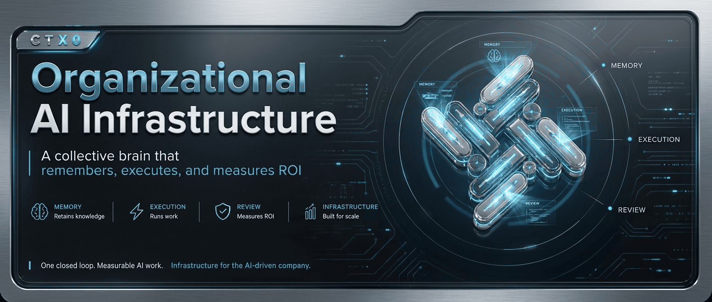
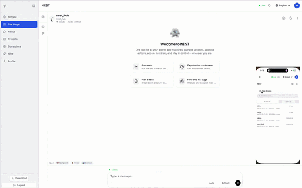
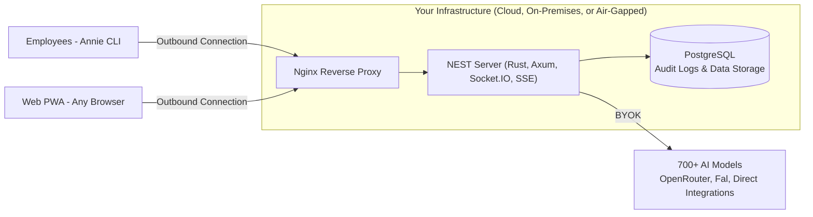

<p align="center">
  
</p>

# NEST — Self-Hosted AI Hub for Enterprise Teams

<p align="center">
  <a href="./LICENSE.md"></a>
  <a href="https://github.com/contextzero/nest_hub/stargazers"></a>
  <a href="https://github.com/contextzero/nest_hub/network"></a>
  <a href="https://hub.docker.com/u/matiasbaglieri"></a>
  <a href="https://www.npmjs.com/package/@contextzero/nest"></a>
  <a href="https://discord.gg/ygjuuDAw"></a>
  <a href="https://t.me/ctx0_io"></a>
</p>

## What is NEST?

NEST is a self-hosted AI workforce hub designed to help organizations deploy and manage AI securely on their own infrastructure.

### Key Features

- **Unified AI Platform** – Consolidates fragmented AI tools and workflows into a single, centralized workspace.
- **Organizational Memory** – Enables teams to store, retrieve, and leverage institutional knowledge efficiently.
- **Multi-Agent Orchestration** – Supports collaboration between multiple AI agents to automate complex tasks and workflows.
- **Extensive Model Access** – Connects to **700+ AI models** through a Bring Your Own Key (BYOK) approach, providing flexibility and choice.
- **Comprehensive Audit Trails** – Maintains detailed activity logs to ensure transparency, governance, and compliance.
- **Self-Hosted & Secure** – Runs entirely on infrastructure owned and controlled by the organization, enhancing data privacy and security.
- **Cost & Operational Control** – Eliminates dependency on third-party AI platforms, giving organizations greater control over expenses and operations.
- **Enterprise-Ready** – Delivers the capabilities of modern AI tooling while preserving data sovereignty and governance requirements.

Developed by **Context Zero (CTX0)** under a fair-code license, NEST empowers organizations to adopt AI without compromising security, compliance, or operational independence.

> ⭐ **If NEST is useful to your team, star the repo** — it helps other organizations find a self-hosted, audited alternative to SaaS AI sprawl. See **[everything we've shipped →](https://github.com/contextzero/nest_hub/issues/17)** — live, dated, and independently verifiable.

<p align="center">
  
</p>

## Watch

| Product (first version) | Product update | Problem &amp; solution |
|:---:|:---:|:---:|
| [](https://youtu.be/KXJgjWesM1s) | [](https://youtu.be/6LcGFfOi8mg) | [](https://youtu.be/5KeN9lwUZwE) |

## Key Capabilities

- **Self-Hosted by Default**: Deploy on cloud, on-prem, or air-gapped — your data never leaves your perimeter
- **BYOK Across 700+ Models**: Connect OpenRouter, Fal AI, and direct provider keys — no platform fees, no lock-in
- **Organizational Memory**: Persistent, project-scoped memory that learns from every employee — owned by your org
- **Multi-Agent Orchestration**: A swarm of specialist agents builds real outputs, with mandatory review and audit
- **Governance Built-In**: RBAC per project, granular approval flows, full audit trail of every prompt and action
- **Replaces 15+ Tools**: One hub for chat, code agents, computer-use automation, and document workflows

## Modules

NEST is organized as a set of composable modules sharing one audit and governance plane:

| Module | Function |
|---|---|
| **MISSION CONTROL** | Routing, projects, roles, approvals |
| **NEXUS** | Model layer — 700+ models via BYOK (OpenRouter, Fal AI, direct providers) |
| **FORGE** | Development layer — Cursor, Claude Code, and Codex on a shared audit trail |
| **OPERATOR** | Desktop automation (computer-use) under governance |
| **HIVE** | Persistent organizational memory, owned by the client |

## Why NEST

| | **NEST** (self-hosted) | SaaS AI hubs | DIY glue scripts |
|---|:---:|:---:|:---:|
| **Data residency** | ✅ Your infra (cloud / on-prem / air-gapped) | ❌ Vendor cloud | ✅ Yours |
| **Model choice** | ✅ 700+ via BYOK, no markup | ⚠️ Vendor shortlist | ⚠️ Per-integration |
| **Full audit trail** | ✅ Every prompt & action | ⚠️ Partial / vendor-held | ❌ None |
| **Per-project RBAC & approvals** | ✅ Built-in | ⚠️ Add-on / higher tier | ❌ Roll your own |
| **Code agents + computer-use + chat** | ✅ One governed plane | ⚠️ Usually chat-only | ❌ Fragmented |
| **Cost model** | ✅ Your keys, no per-seat platform fee | ❌ Per-seat + markup | ✅ Infra only |
| **Lock-in** | ✅ Fair-code, source-available | ❌ Proprietary | ✅ None |

Here's a cleaner and more professional version:

## Architecture

NEST is designed to run entirely on infrastructure you control, whether in the cloud, on-premises, or within air-gapped environments. Employee devices connect securely to the hub using outbound connections only, while AI model providers are accessed through your organization's own API keys (BYOK). This architecture ensures data sovereignty, security, and operational control without requiring inbound access from external parties.

### Architecture Overview

* **Employee Access** – Users interact with NEST through the Annie CLI or the web-based PWA from any browser.
* **Outbound-Only Connectivity** – All client connections are outbound, minimizing exposure and simplifying network security.
* **Self-Hosted Deployment** – NEST runs entirely on infrastructure owned and managed by your organization.
* **High-Performance Backend** – Powered by a Rust-based server built with Axum, Socket.IO, and Server-Sent Events (SSE) for scalable real-time communication.
* **Persistent Audit Logging** – PostgreSQL stores organizational data and maintains comprehensive audit trails for governance and compliance.
* **Flexible Model Integration** – Connect to 700+ AI models through a Bring Your Own Key (BYOK) approach using providers such as OpenRouter, Fal, and direct model integrations.


```mermaid
flowchart LR
    CLI["Employees - Annie CLI"] -->|Outbound Connection| NG
    PWA["Web PWA - Any Browser"] -->|Outbound Connection| NG

    subgraph INFRA["Your Infrastructure (Cloud, On-Premises, or Air-Gapped)"]
        NG["Nginx Reverse Proxy"] --> SRV["NEST Server (Rust, Axum, Socket.IO, SSE)"]
        SRV --> DB[("PostgreSQL<br/>Audit Logs & Data Storage")]
    end

    SRV -->|BYOK| LLM["700+ AI Models<br/>OpenRouter, Fal, Direct Integrations"]
```

This version explains *why* the architecture matters, not just *what* the components are, which is usually more valuable in documentation.


Architecture: hexagonal (`domain` → `ports` → `application` → `adapters`). See the [security model](docs/SECURITY-MODEL.md) for the data-residency and audit posture.

## Why Self-Hosting?

NEST is designed for organizations that require full control over their AI infrastructure.

### Benefits

- Data remains within your infrastructure.
- No vendor lock-in for AI models.
- Flexible deployment across cloud, on-premises, or air-gapped environments.
- Complete visibility through audit logging and governance controls.
- Better cost management through BYOK model integrations.

## Quick Start

Deploy NEST on your own infrastructure using Docker. The setup script automatically generates the required secrets, downloads the latest published images, starts all services, and performs health checks to ensure the deployment is successful.

### Prerequisites

Before starting, ensure the following tools are installed:

* Docker
* Docker Compose
* Git

### Installation

```bash
git clone https://github.com/contextzero/nest_hub.git
cd nest_hub
./setup.sh
```

### Accessing NEST

Once deployment is complete, open the Progressive Web App (PWA) in your browser:

```text
http://localhost
```

If you have configured a custom `WEB_PORT` in your `.env` file, use that port instead.

The PWA can be installed on desktop, tablet, and mobile devices for a native-app-like experience.

### Day-2 Operations

Common operational commands:

```bash
docker compose up -d                          # Start services
docker compose down                           # Stop services
docker compose logs -f                        # Stream logs
docker compose pull && docker compose up -d   # Update to the latest images
```

## Troubleshooting

### Docker is not running

If you encounter Docker connection errors during setup, ensure that Docker is installed and running before executing:

```bash
./setup.sh
```

### Port already in use

If `localhost` is unavailable after deployment, verify that the configured port is not being used by another application. You can also modify the `WEB_PORT` value in your `.env` file.

### Services fail to start

Check container status and logs:

```bash
docker compose ps
docker compose logs -f
```

### Updating NEST

To update to the latest published images:

```bash
docker compose pull
docker compose up -d
```


### CLI for developer machines

Connect each workstation to your hub with the published CLI (package `@contextzero/nest`, binary `annie`):

```
npm install -g @contextzero/nest
annie auth login          # base URL of your hub + CLI token
annie claude              # or: annie cursor / annie codex / annie gemini ...
```

## Resources

- 📦 [What's shipped — changelog](https://github.com/contextzero/nest_hub/issues/17)
- 📚 [Quick Start](QUICKSTART.md)
- 🛠 [Installation reference](docs/INSTALL.md)
- 🌐 [Production deploy (HTTPS)](docs/DEVOPS.md)
- 🔐 [Security model](docs/SECURITY-MODEL.md)
- 🤖 [CLI &amp; LLM / BYOK config](docs/CLI-BUSINESS.md)
- 🎬 [Product — first version](https://youtu.be/KXJgjWesM1s)
- 🆕 [Product update](https://youtu.be/6LcGFfOi8mg)
- 🎥 [Problem &amp; solution](https://youtu.be/5KeN9lwUZwE)
- 📹 [Demo videos &amp; GIFs (download)](https://github.com/contextzero/nest_hub/releases/tag/media-v1)
- 👥 [Community](https://github.com/contextzero/nest_hub/discussions)

## Support

For installation questions and community support, open a [discussion](https://github.com/contextzero/nest_hub/discussions) or file an issue.

For enterprise support, SSO, advanced RBAC, and air-gapped deployments, contact [caro@ctx0.io](mailto:caro@ctx0.io).

## Community

- **Discord:** [discord.gg/ygjuuDAw](https://discord.gg/ygjuuDAw) — fastest way to ask questions; the team is there
- **Telegram:** [t.me/ctx0_io](https://t.me/ctx0_io)
- **Issues:** [github.com/contextzero/nest_hub/issues](https://github.com/contextzero/nest_hub/issues)
- **Discussions:** [github.com/contextzero/nest_hub/discussions](https://github.com/contextzero/nest_hub/discussions)

We respond within 24 hours. Usually faster.

## Star history

If NEST helps your team, a ⭐ makes it discoverable for the next one.

<a href="https://star-history.com/#contextzero/nest_hub&Date">
  
</a>

## License

NEST is [fair-code](https://faircode.io) distributed under the [Sustainable Use License](https://github.com/contextzero/nest_hub/blob/main/LICENSE.md) and [NEST Enterprise License](https://github.com/contextzero/nest_hub/blob/main/LICENSE_EE.md).

- **Source Available**: Always visible source code
- **Self-Hostable**: Deploy anywhere — cloud, on-prem, or air-gapped
- **Extensible**: Add your own model providers, MCP servers, and agent specialists

[Enterprise licensing](mailto:caro@ctx0.io) available for advanced features and support.

> **Legal entity note.** **Context Zero** ("CTX0") is the brand and project, launched February 2026. The legal entity operating it is **Carlos Matias Baglieri LTD**, a UK private limited company (Company number 14267762, registered at 20-22 Wenlock Road, London, England, N1 7GU). All licensing, contracts, and IP rights are held by this entity. Governing law: England and Wales.

## Contributing

Found a bug 🐛 or have a feature idea ✨? Check our [Contributing Guide](https://github.com/contextzero/nest_hub/blob/main/CONTRIBUTING.md) for setup and best practices.

## Join the Team

Want to shape the future of enterprise AI infrastructure? Email us at [caro@ctx0.io](mailto:caro@ctx0.io) and tell us what you'd build.

## What does NEST mean?

**Short answer:** It is the hub where your organization's AI work lives — model access, agents, memory, and audit, all in one place.

**Long answer:** NEST is the gateway product of the Context Zero (CTX0) ecosystem. We started with a simple observation: companies have perfect visibility into their cloud spend and zero visibility into their AI spend. The same knowledge worker touches 14 AI tools and 6 subscriptions a week, with no shared memory, no audit, and no answer to the question "is this actually working?". NEST is the missing infrastructure layer that gives that answer back to the organization — without taking away the speed of the tools developers already love. It's free to self-host, fair-code by design, and built to scale with you toward the Team and Enterprise tiers of the CTX0 platform.

— **Carolina Fogliato**, Founder & CEO, Context Zero

## Built by

Shipping in public since February 2026.

- **Carolina Fogliato** — Founder & CEO
- **Matías Baglieri** — Fractional CAIO/CTO

Questions, feedback, or enterprise inquiries: caro@ctx0.io

---

## Important notice — self-hosted deployments, responsibility, and access

The following is a **general information notice** for customers and operators. It is **not** tailored legal advice; your counsel should review it against your contracts, jurisdiction, and regulatory obligations.

**Use and compliance.** Your organization — **not** Carlos Matias Baglieri LTD (operating the "Context Zero" / "CTX0" project), including its affiliates, contractors, or personnel (collectively "**Context Zero**") — is **solely responsible** for how you deploy, configure, secure, and use NEST, including all outputs of AI agents, integrations, data processing, employment practices, export controls, privacy, sectoral regulations, and internal policies. Context Zero does not supervise your runtime environment and does not assume liability for decisions your employees, agents, or systems make on your infrastructure.

**Self-hosted connectivity.** When you operate NEST as **self-hosted** software on infrastructure you control, **Context Zero does not operate that server**, does not receive an automatic administrative connection to it, and **cannot access** your installation merely because you downloaded or licensed materials from us. Your hub is joined by your users and tooling (for example the **`annie`** CLI from **`npm install -g @contextzero/nest`**) **outbound** to the endpoints **you** configure (your DNS, your TLS certificates, your tokens). Unless you separately contract for managed services that explicitly provide remote administration and scope of access, **no member of the Context Zero team is granted inbound access** to your servers as part of the self-hosted product model.

**No agency.** Nothing in this README creates a partnership, joint venture, or agency relationship. Context Zero is a software provider; **your company remains exclusively responsible** for lawful use, workforce governance, and the security of your deployment.

---

<div align="center">

*Public distribution: [contextzero/nest_hub](https://github.com/contextzero/nest_hub) · CLI: [@contextzero/nest](https://www.npmjs.com/package/@contextzero/nest)*

**© 2026 Carlos Matias Baglieri LTD · Operating the Context Zero / CTX0 project**

</div>
